# Ejercicio 1: Creando imágenes

## Paso 1

1. **Ejecuta un contenedor basado en la imagen:**
   `ubuntu`

   - `$ docker run --name ubuntu-devops ubuntu`


   

2. **Accede a la terminal del contenedor.**
   - `$ docker run -it --name ubuntu-devops ubuntu /bin/bash`
   


3. **Instala `curl`:**
   ```bash
   apt-get update
   apt-get install curl

   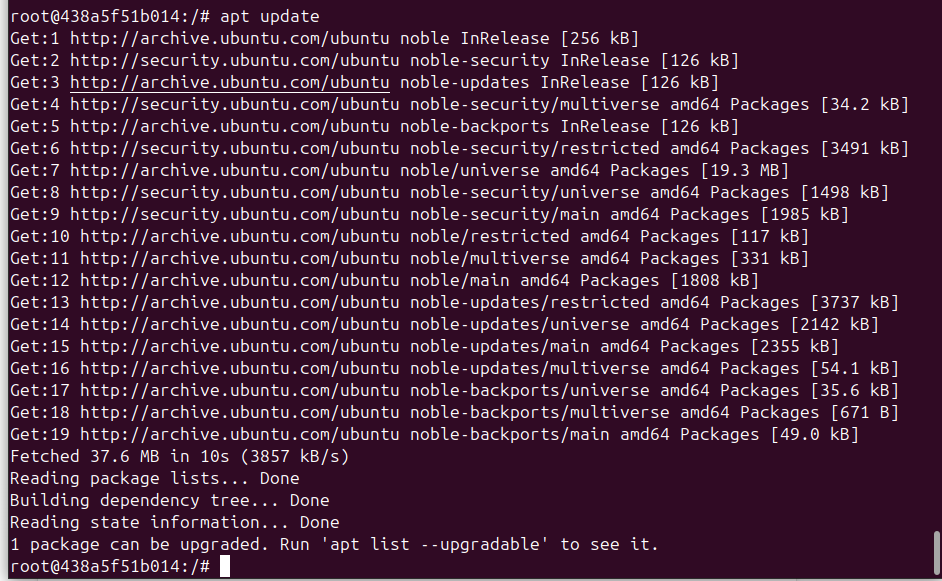
   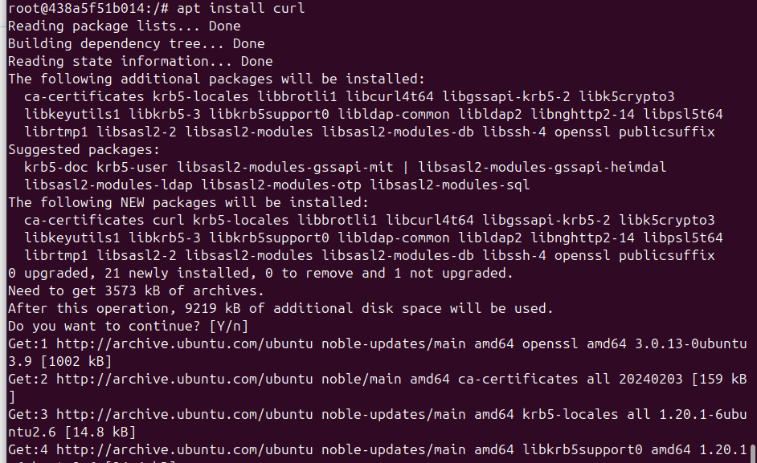
   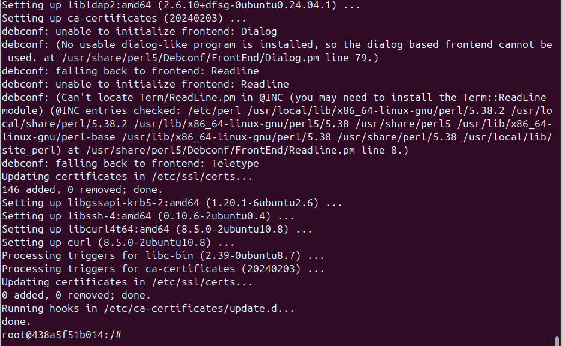

4. **Comprueba que funciona**

   curl --version

   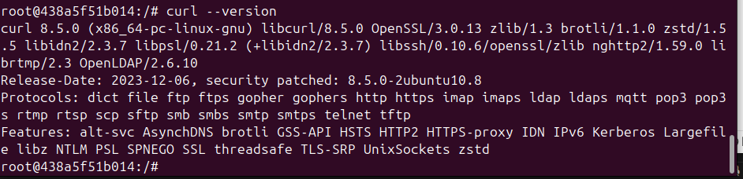

**Pregunta**
¿Con qué comando podrías guardar los cambios del contenedor como una nueva imagen?

   - `docker commit ubuntu-devops ubuntu-con-curl`
   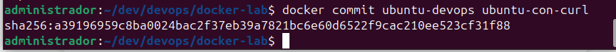

## Paso 2 --- Dockerfile

Crea un `Dockerfile` que haga lo mismo automáticamente.

Ejemplo:

```dockerfile
FROM ubuntu

RUN apt-get update && apt-get install -y curl
```

Construye la imagen y ejecuta un contenedor.
- `$ docker build -t ubuntu-con-curl-build .`
- `$ docker run -it ubuntu-con-curl-build /bin/bash`

   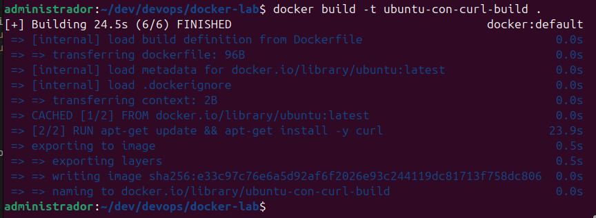

Comprueba que `curl` está instalado.

   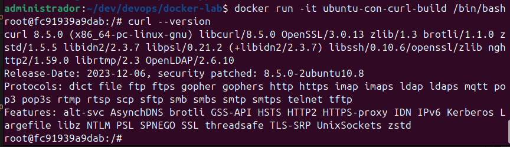

---

## Pregunta

¿Qué comando permite ver las **capas de una imagen Docker**?

   - `docker history ubuntu-con-curl-build`

---

# 3. Volúmenes persistentes

Ejecuta un contenedor de:

    postgres

Usa un volumen Docker montado en:

    /var/lib/postgresql/data

   - `$ docker volume create postgres-data`
   - `$ docker run --name postgres -v postgres-data:/var/lib/postgresql/data -e POSTGRES_PASSWORD=mipassword -d postgres`

   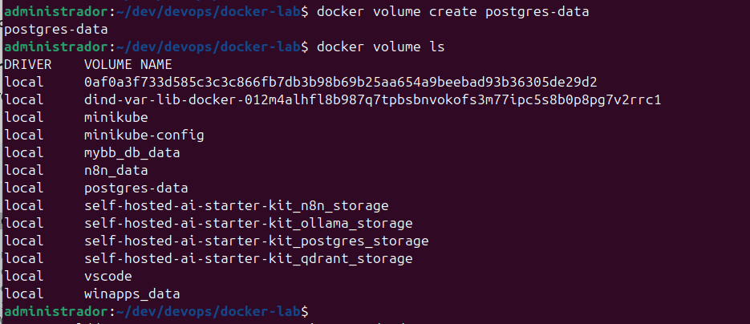

   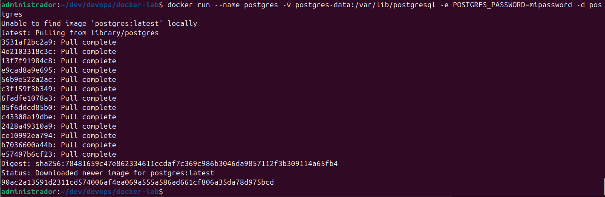

## Crear tabla

Conéctate a la base de datos.

   - `$ docker exec -it postgres psql -U postgres`

Crea la tabla:

```sql
CREATE TABLE items (
 id SERIAL PRIMARY KEY,
 name TEXT
);
```

Inserta un registro:

```sql
INSERT INTO items(name) VALUES ('item1');
```

   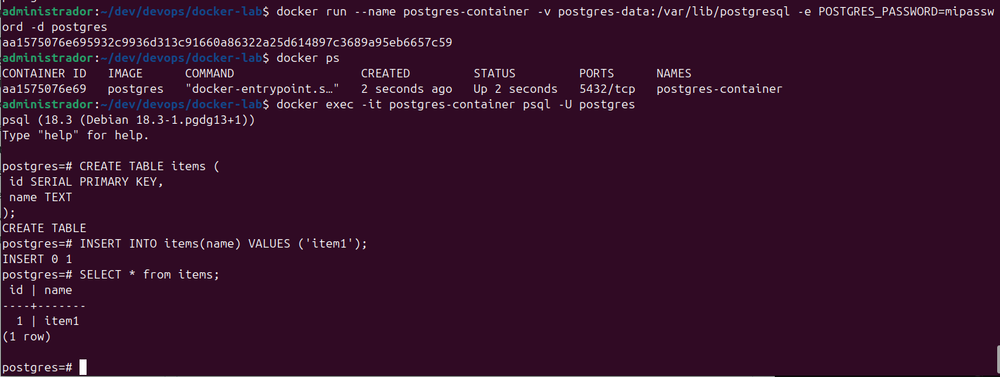

## Comprobación

1.  Para el contenedor
2.  Elimina el contenedor
3.  Crea un nuevo contenedor usando **el mismo volumen**

   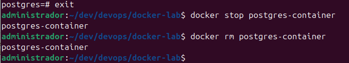

   

Comprueba que los datos siguen existiendo.

# 4. Bind mounts

Crea un archivo en tu máquina:

    index.html

Ejemplo:

```html
<h1>Hola Docker</h1>
```

---

Ejecuta un contenedor `nginx`:

- mapea el puerto `80`
- monta el archivo en:

```{=html}
<!-- -->
```

    /usr/share/nginx/html/index.html

Abre el navegador.

---

Pregunta:

¿Qué ocurre si modificas el archivo `index.html` en tu máquina?

---


