# Ejercicio 1: Creando imágenes

## Paso 1

1. **Ejecuta un contenedor basado en la imagen:**
   `ubuntu`

   - `$ docker run --name ubuntu-devops ubuntu`


   

2. **Accede a la terminal del contenedor.**
   - `$ docker run -it --name ubuntu-devops ubuntu /bin/bash`
   


3. **Instala `curl`:**
   ```bash
   apt-get update
   apt-get install curl
   ```
   
   
   

4. **Comprueba que funciona**

   curl --version

   

**Pregunta**
¿Con qué comando podrías guardar los cambios del contenedor como una nueva imagen?

   - `docker commit ubuntu-devops ubuntu-con-curl`
   

## Paso 2 --- Dockerfile

Crea un `Dockerfile` que haga lo mismo automáticamente.

Ejemplo:

```dockerfile
FROM ubuntu

RUN apt-get update && apt-get install -y curl
```

Construye la imagen y ejecuta un contenedor.
- `$ docker build -t ubuntu-con-curl-build .`
- `$ docker run -it ubuntu-con-curl-build /bin/bash`

   

Comprueba que `curl` está instalado.

   

---

## Pregunta

¿Qué comando permite ver las **capas de una imagen Docker**?

   - `docker history ubuntu-con-curl-build`

---

# 3. Volúmenes persistentes

Ejecuta un contenedor de:

    postgres

Usa un volumen Docker montado en:

    /var/lib/postgresql/data

   - `$ docker volume create postgres-data`
   - `$ docker run --name postgres -v postgres-data:/var/lib/postgresql/data -e POSTGRES_PASSWORD=mipassword -d postgres`

   

   

## Crear tabla

Conéctate a la base de datos.

   - `$ docker exec -it postgres psql -U postgres`

Crea la tabla:

```sql
CREATE TABLE items (
 id SERIAL PRIMARY KEY,
 name TEXT
);
```

Inserta un registro:

```sql
INSERT INTO items(name) VALUES ('item1');
```

   

## Comprobación

1.  Para el contenedor
2.  Elimina el contenedor
3.  Crea un nuevo contenedor usando **el mismo volumen**

   

Comprueba que los datos siguen existiendo.

   
   

# 4. Bind mounts

Crea un archivo en tu máquina:

    index.html

Ejemplo:

```html
<h1>Hola Docker</h1>
```

   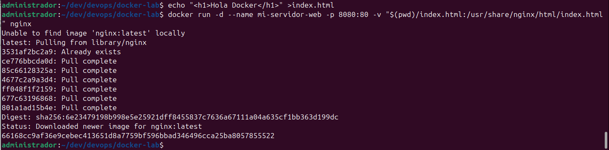
---

Ejecuta un contenedor `nginx`:

- mapea el puerto `80`
- monta el archivo en:

```{=html}
<!-- -->
```

    /usr/share/nginx/html/index.html

Abre el navegador.

   
---

Pregunta:

¿Qué ocurre si modificas el archivo `index.html` en tu máquina?

   - Automáticamente se modifica en el contenedor, actualizandose en la web del navegador.

   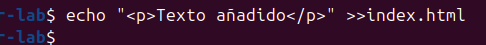
   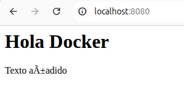
---

# 5. Auditando volúmenes (opcional)

Investiga:

¿Qué comando permite ver **dónde guarda Docker los datos de un
volumen**?
   - `$ docker volume inspect postgres-data`

   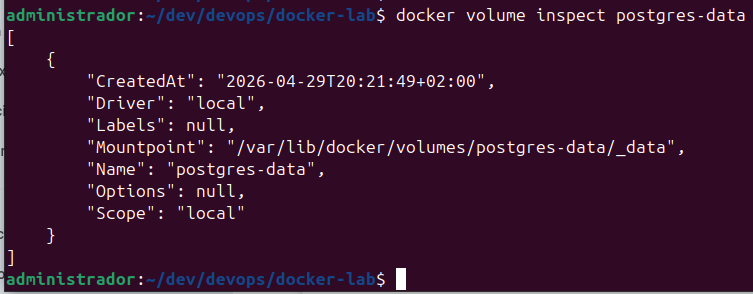
---

# 6. Creando redes privadas

Crea una red llamada:

    my-net
   - `docker network create my-net`

   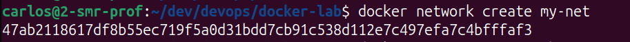
---

Arranca dos contenedores `ubuntu` en esa red.
   - `docker run -it --name ubuntu1 --network my-net ubuntu bash`
   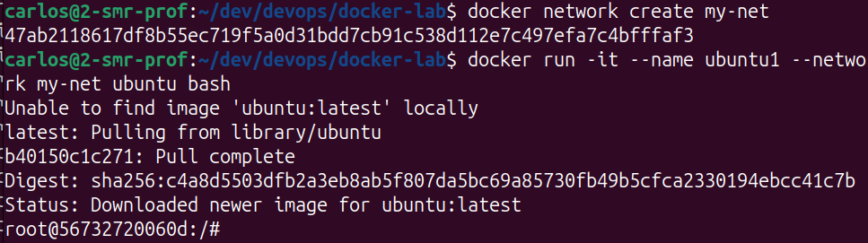


   - `docker run -it --name ubuntu2 --network my-net ubuntu bash`
   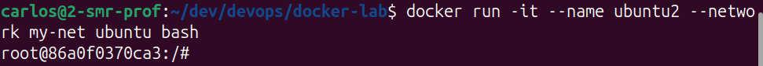

Instala `ping` si es necesario.

   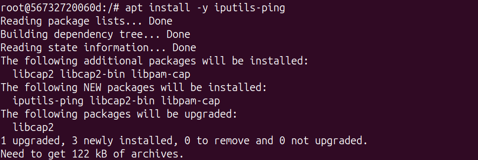


Desde un contenedor intenta hacer:

```bash
ping otro_contenedor
```
   - Desde ubuntu1: `$ ping -c 1 ubuntu2`
   - Desde ubuntu2: `$ ping -c 1 ubuntu1`

   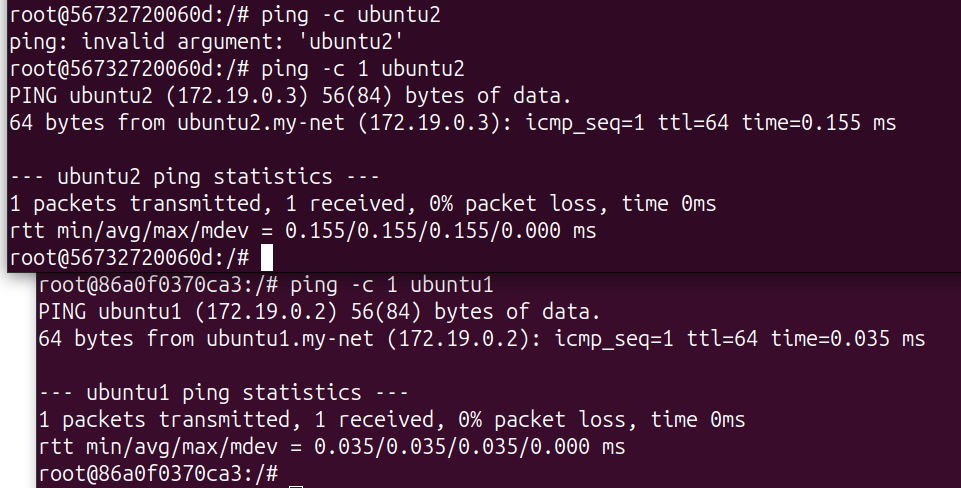
---

Pregunta

¿Los contenedores pueden comunicarse entre sí?
Sí. Pueden usar el nombre del contenedor gracias al DNS interno de la red creada.

   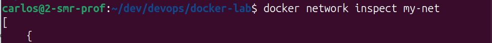

   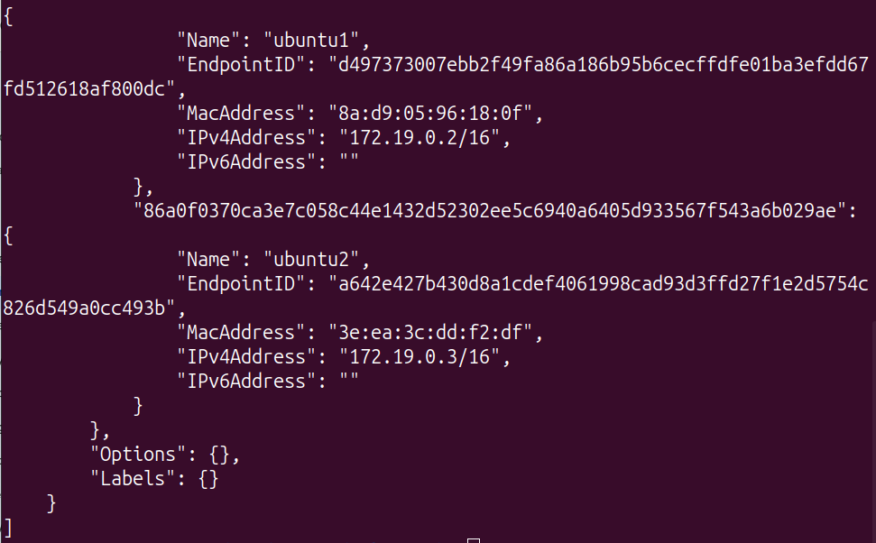
---

# 7. Red none (opcional)

Investiga:

¿Para qué serviría ejecutar un contenedor con red:

    none

   - Ejecución aislada de la red, evitando ataques y fuga de datos.
---

# 8. Multi-network (opcional)

Crea dos redes:

    secure-zone
    public-zone

   - `$ docker network create secure-zone`
   - `$ docker network create public-zone`

Arranca un contenedor en `public-zone`.
   - `$ docker run -it -name ubuntu-public --network public-zone ubuntu bash`

   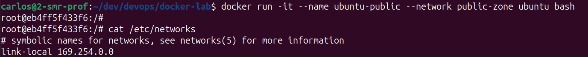

Pregunta:

¿Puedes conectarlo también a `secure-zone`?
   - Sí. Los contenedores pueden tener varias interfaces de red.
¿Qué comando usarías?
   - `docker network connect secure-zone ubuntu-public`
   - comprobación: `docker inspect ubuntu-public`
   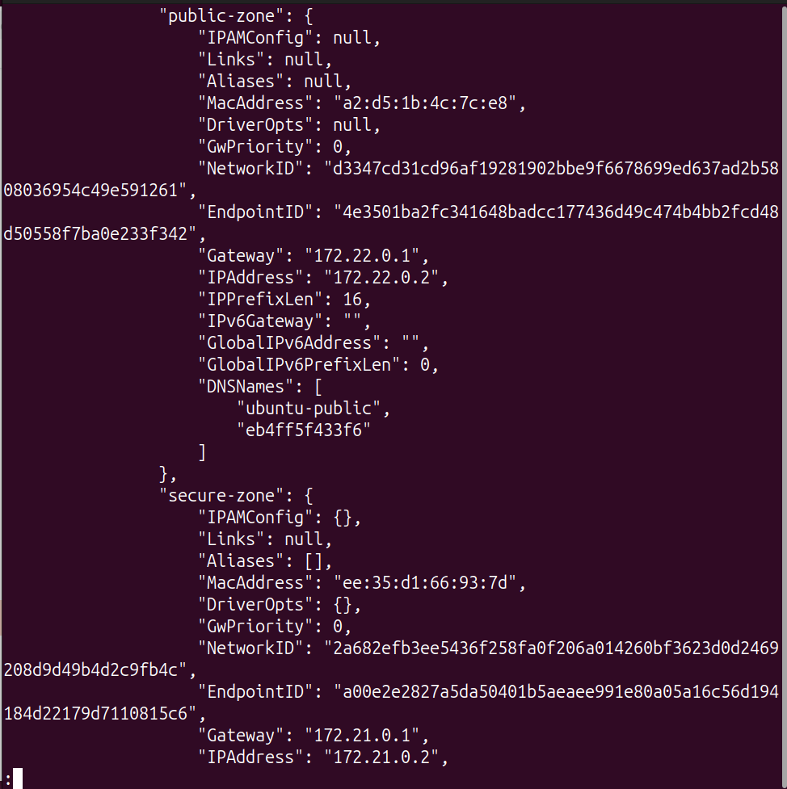
---

# 9. Docker Compose --- Compartiendo volúmenes

Crea un fichero:

    docker-compose.yml

Con dos servicios.


---

## writer

Debe:

- montar un volumen en `/app/logs`
- escribir un timestamp cada 30 segundos

---

## reader

Debe:

- montar el volumen en modo solo lectura
- mostrar el contenido en consola

   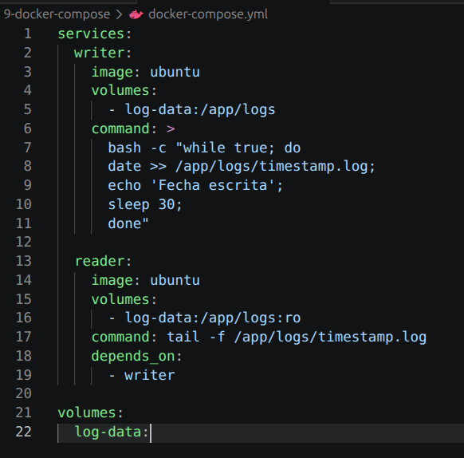

---

## Ejecución

   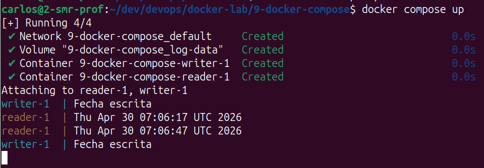

   - Parada y ejecución (El volumen mantiene logs anteriores)
   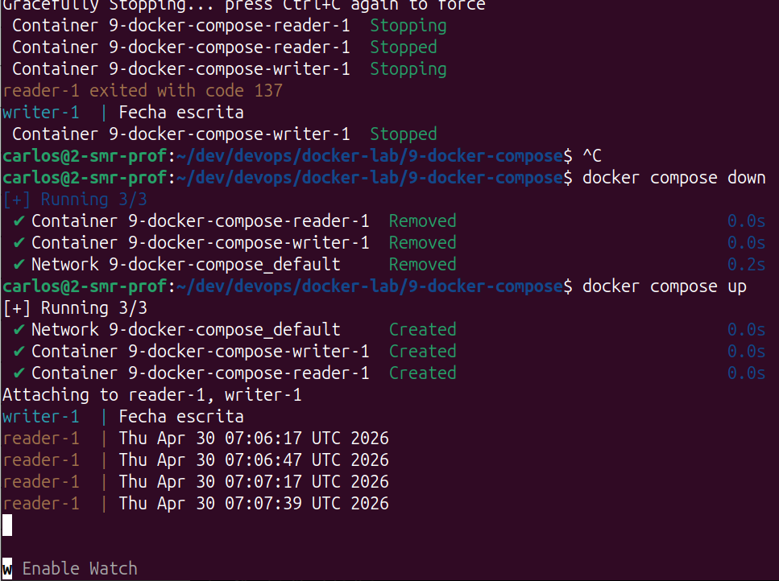

---

# 10. Docker Compose Profiles (opcional)

Crea un `docker-compose.yml` con:

- `postgres`
- `pgadmin`

Haz que `pgadmin` pueda conectarse a `postgres`.

---

Crea dos perfiles:

### Perfil completo

Levanta:

- postgres
- pgadmin

### Perfil base

Levanta solo:

- postgres


## docker-compose.yml
```
services:
  postgres:
    image: postgres
    environment:
      POSTGRES_PASSWORD: mipassword
    profiles:
      - base
      - completo

  pgadmin:
    image: dpage/pgadmin4
    environment:
      PGADMIN_DEFAULT_EMAIL: admin@miapp.com
      PGADMIN_DEFAULT_PASSWORD: admin
    ports:
      - "8080:80"
    profiles:
      - completo
    depends_on:
      - postgres
```
## Ejecuciones
   - profile base: `$ docker compose --profile base up`

   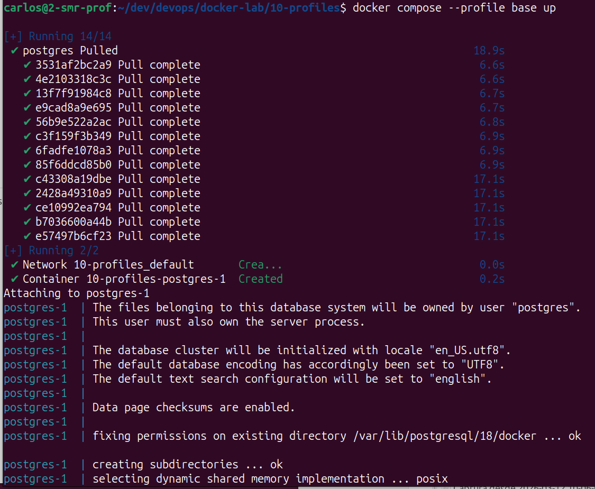

   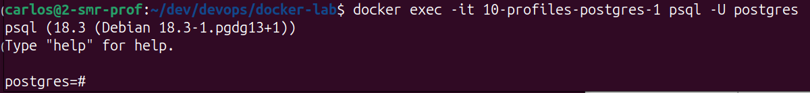

   - profile completo: `$ docker compose --profile completo up`

   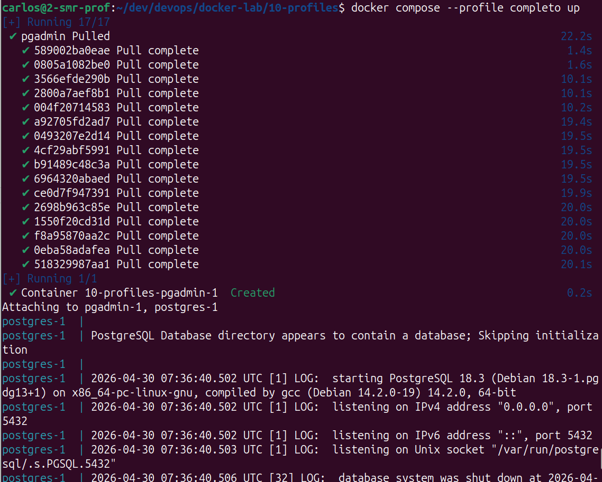

   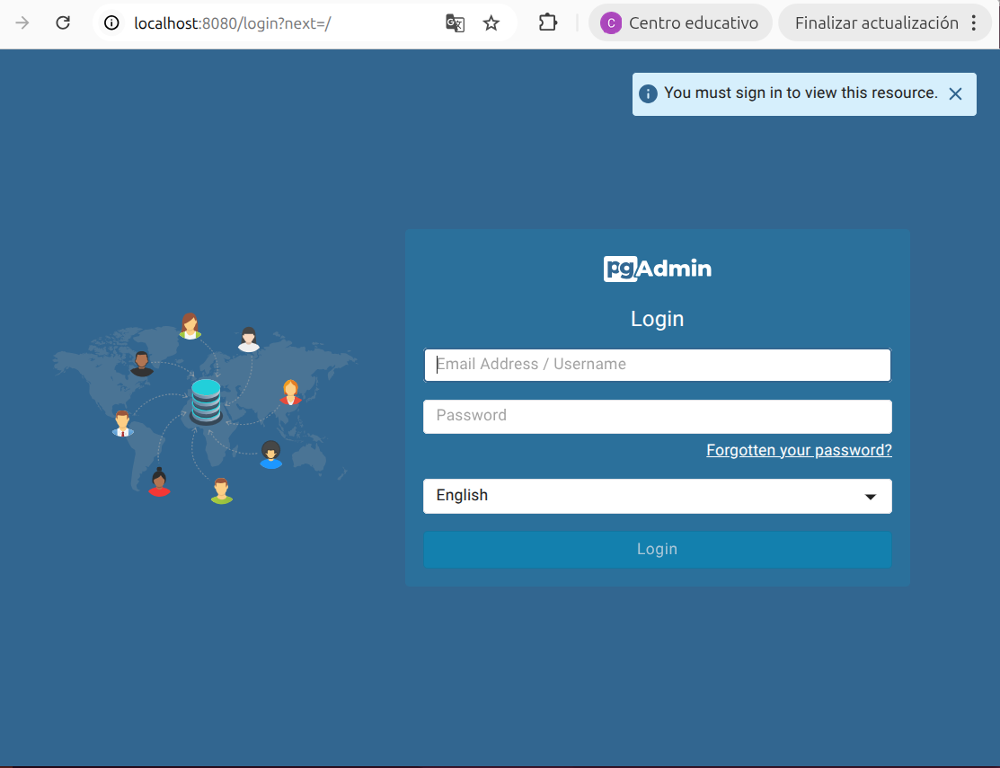
---
