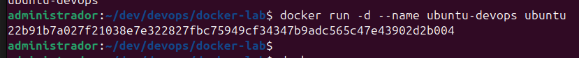
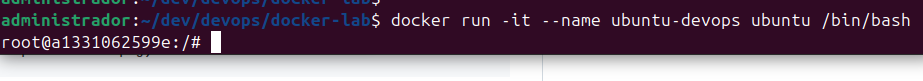

# Ejercicio 1: Creando imágenes

## Paso 1

1. **Ejecuta un contenedor basado en la imagen:**
   `ubuntu`

   

2. **Accede a la terminal del contenedor.**
   

3. **Instala `curl`:**
   ```bash
   apt-get update
   apt-get install curl
   
